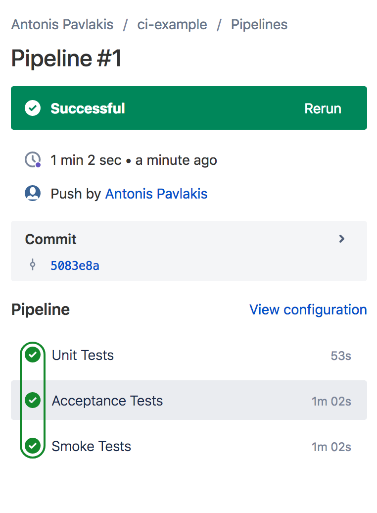
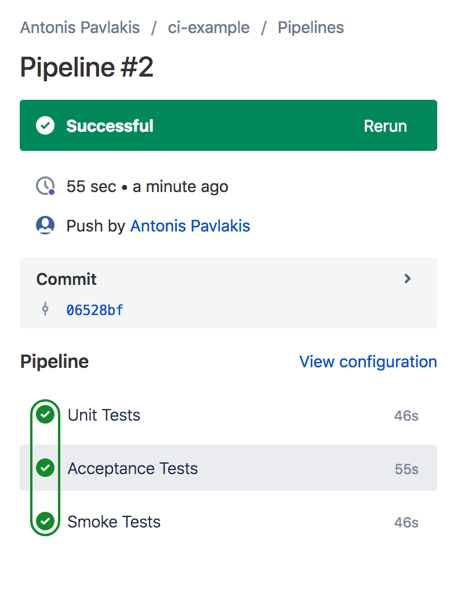

# CI example scripts

This project aims to give a starting point to anyone interested on getting started with CI Pipelines.

A very basic PHP project has been created where some of these examples will run either using Docker-In-Docker or in Bitbucket pipelines.


The available scripts can be used to run:

* Unit tests
* Integration tests
* Acceptance tests
* Smoke tests


It also includes examples on:

* Load DB schema
* Run DB migrations

## Docker in Docker

To run it directly using [Docker-in-Docker](https://hub.docker.com/_/docker/)

```

docker run --privileged --name docker-master-docker -v `pwd`:/var/www/html -d docker:stable-dind
docker exec -it docker-master-docker sh

cd /var/www/html
./ci/scripts/install-docker-compose.sh 
```

## Bitbucket Pipelines

The following `bitbucket-pipelines.yml` example file, will run each tests as a separate pipeline step.

```yml

image: docker:stable

options:
  docker: true


pipelines:
  default:
    - parallel:
        - step:
            name: Unit Tests
            script:
              - ci/scripts/install-docker-compose.sh
              - ci/scripts/step-run-unit-tests.sh
        - step:
            name: Acceptance Tests
            script:
              - ci/scripts/install-docker-compose.sh
              - ci/scripts/step-run-acceptance-tests.sh app
        - step:
            name: Smoke Tests
            script:
              - ci/scripts/install-docker-compose.sh
              - ci/scripts/step-run-smoke-tests.sh


```

Example of running the above default pipeline:




### Optimisations

We are already pulling a pre-built image with PHP/Apache/Composer with an Apache vhost configuration that points to `/var/www/html/web`.
This of course is much faster than building our images on each step using a `Dockerfile`.

To run it even faster, we can modify the tests which do not require the use of a database, by loading `docker-compose` with only the services we need to use. 
e.g.

```
docker-compose -f docker-web.yml up -d
```

In the current example, the improvement of not running the DB containers on two of the steps results in the following:




